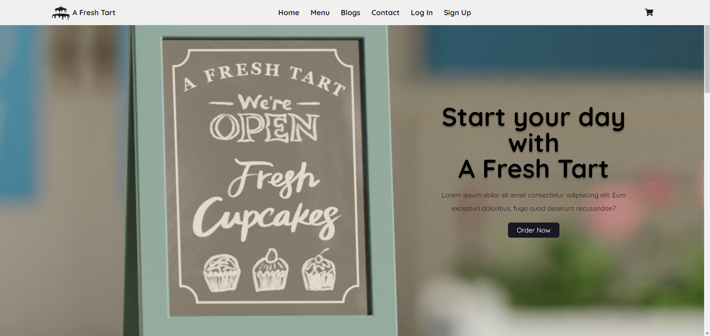
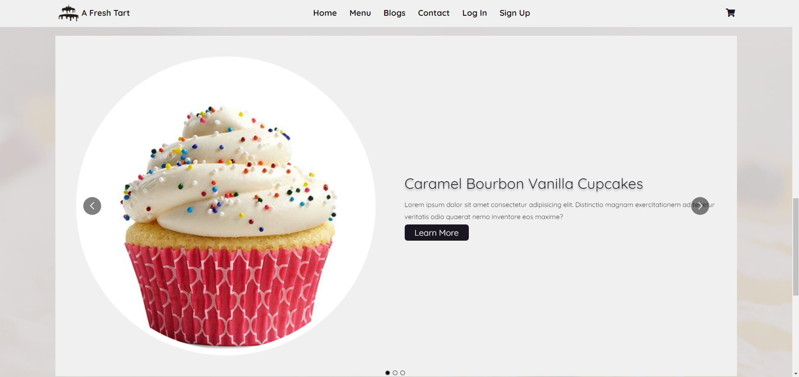
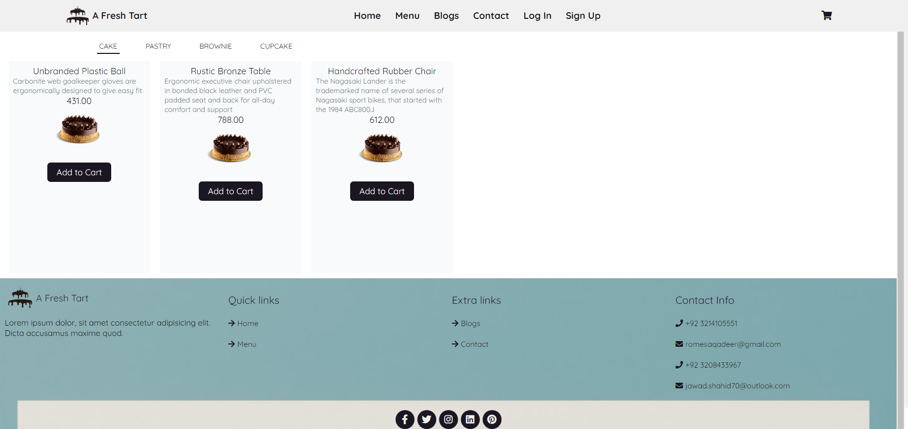
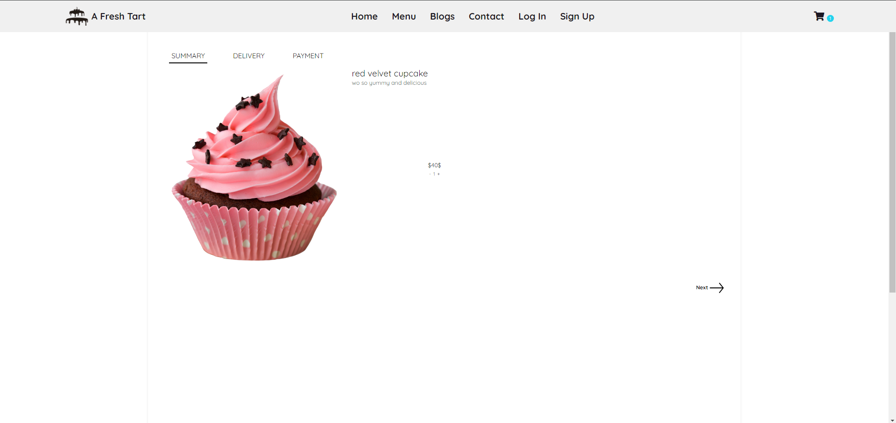
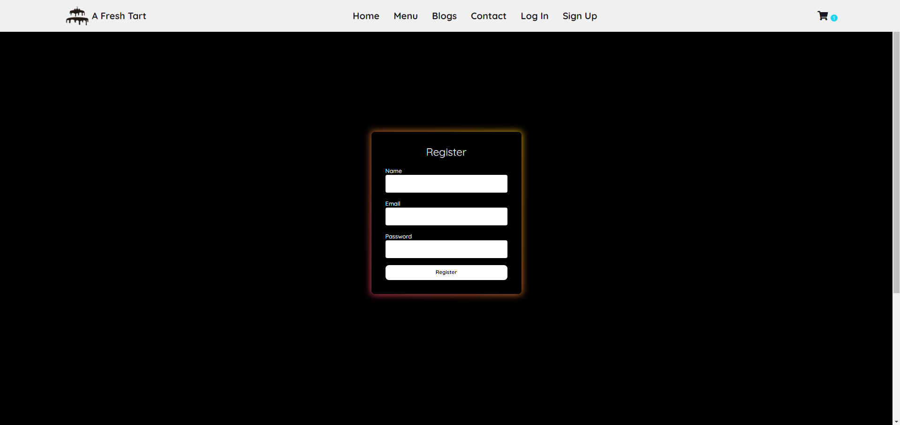

# A Fresh Tart

Welcome to the GitHub repository for **A Fresh Tart**, a bakery web application designed to bring the delightful world of baked goods directly to your doorstep. Our app allows users to explore a variety of bakery items, read engaging bakery-related blogs, view our menu, and place orders with ease.

## Features

- **View Blogs**: Users can read blogs related to baking, recipes, and the latest trends in the bakery world.
- **Menu Exploration**: Browse through our detailed menu to find descriptions and prices of the items.
- **Categories**: Items are organized by category for easy navigation.
- **User Authentication**: Secure login and registration functionality using Firebase Authentication.
- **Order Placement**: Users can place orders directly through the app. The payment process is handled securely via Stripe API.
- **Contact Us**: A dedicated page for users to reach out with their queries or feedback.

## Technology Stack

This project is built using the MERN stack:
- **MongoDB**: A document-based open source database.
- **Express**: A web application framework for Node.js.
- **React**: A JavaScript library for building user interfaces.
- **Node.js**: A JavaScript runtime built on Chrome's V8 JavaScript engine.

Additional technologies:
- **Firebase Authentication**: For handling user authentication.
- **Stripe API**: To process payments securely.

## Installation

To get this project up and running on your local machine, follow these steps:

1. Clone the repository:
    ```
    git clone https://github.com/jawadshahid07/a-fresh-tart.git
    ```
2. Navigate to the project directory:
    ```
    cd a-fresh-tart
    ```
3. Install dependencies:
    ```
    npm install
    ```
4. Set up environment variables:
    ```
    Create a .env file in the root directory and add the following:
    STRIPE_SECRET_KEY="<enter here>"
    STRIPE_WEBHOOK_SECRET="<enter here>"
    REACT_APP_STRIPE_PUBLISHABLE_KEY="<enter here>"
    
    REACT_APP_FIREBASE_CONFIG_API_KEY="<enter here>"
    REACT_APP_FIREBASE_CONFIG_AUTH_DOMAIN="<enter here>"
    REACT_APP_FIREBASE_CONFIG_PROJECT_ID="<enter here>"
    REACT_APP_FIREBASE_CONFIG_STORAGE_BUCKET="<enter here>"
    REACT_APP_FIREBASE_CONFIG_MESSAGING_SENDER_ID="<enter here>"
    REACT_APP_FIREBASE_CONFIG_APP_ID="<enter here>"
    REACT_APP_FIREBASE_CONFIG_MEASUREMENT_ID="<enter here>"
    ```
5. Install MongoDB server
   ```
   In server->db->index.js,
   update connection string accordingly
   ```

5. Run the frontend: 
    ```
    npm start
    ```
6. Run the server:
   ```
   cd server
   node index.js
   ```

## Usage

After installation, the web app will be accessible on `http://localhost:3000`.
**You can add products by either running the seed.js file available in server folder, or running the createCategory.js and createProduct.js files in server folder.**

## Screenshots

### Landing Page


### Blog Section


### Menu Page


### Checkout Page


### Register Section


## Contributing

Interested in contributing to **A Fresh Tart**? We welcome contributions from all developers. To contribute, please:
1. Fork the repository.
2. Create your feature branch (`git checkout -b feature/AmazingFeature`).
3. Commit your changes (`git commit -m 'Add some AmazingFeature'`).
4. Push to the branch (`git push origin feature/AmazingFeature`).
5. Open a Pull Request.
